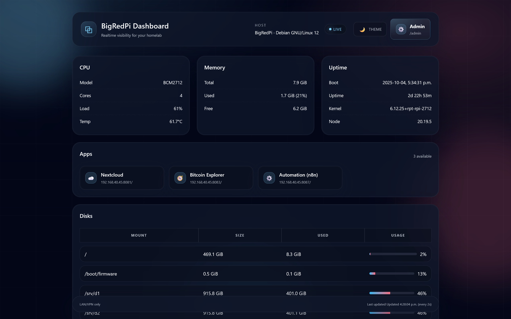

# BigRedPi Homelab (Raspberry Pi 5)

> **Modular home server.** Pick the pieces you want; skip the rest. Every module here is **optional** and can be run independently:
>
> * **Dashboard** (Node/Express) — live Pi stats & Docker visibility (LAN/VPN‑only)
> * **WireGuard VPN** (Docker) — secure remote access into your LAN
> * **Bitcoin Core** (Docker) — pruned/full node with optional **Tor** sidecar for onion P2P
> * **Nextcloud** (Docker) — personal cloud (LAN/VPN‑only)
> * **Storage Pool (mergerfs + SnapRAID)** — simple, grow‑as‑you‑go pooled storage across multiple USB SSDs with optional parity/bit‑rot protection
> * **Offline Knowledge (ZIM Server)** — local **Kiwix** server for offline Wikipedia, Wiktionary, etc. (LAN/VPN‑only)
>
> Security by default: **only UDP 51820 (WireGuard)** is exposed via router port‑forward. All other web UIs are **LAN/VPN‑only**.

<div align="center">

[](https://www.raspberrypi.com/)
[](https://www.raspberrypi.com/software/)
[](https://nodejs.org/)
[](https://expressjs.com/)
[](https://docs.docker.com/compose/)
[](https://www.wireguard.com/)
[](https://bitcoincore.org/)
[](https://torproject.org)
[](https://nextcloud.com)
[](https://github.com/trapexit/mergerfs)
[](https://www.snapraid.it/)
[](https://kiwix.org)

</div>

---

## Project Overview



### Key Features

* **Modular by design**: start with **Dashboard + VPN**; add **Bitcoin Core**, **Nextcloud**, **Offline Knowledge**, and/or the **Storage Pool** later. You can run **any subset** of modules.
* **Secure defaults**: LAN/VPN‑only web UIs, strong `.env` secrets, no public HTTP ports.
* **Clean UI**: SSE‑powered dashboard—live CPU/temp, memory, disks, Docker containers.
* **Easy VPN**: containerized WireGuard with QR codes for mobile peers.
* **Bitcoiner‑ready**: pruned or full node, optional Tor onion service for P2P; RPC stays private on LAN/VPN.
* **Grow‑as‑you‑go storage**: **mergerfs** pools mismatched SSDs into one path; add **SnapRAID** for nightly parity and bit‑rot scrubbing.
* **Offline knowledge**: host **Kiwix** with Wikipedia/Wiktionary/etc. ZIMs; browse locally at `:8082`.

---

## Technology Stack

[Badges omitted here; see header.]

**Dependencies**

* Node ≥ 20, Docker Engine + Compose, UFW
* Dashboard server deps: `express`, `helmet`, `compression`, `morgan`, `systeminformation`

---

## Repository Layout

```
repo/
├─ package.json              # name: bigredpi-dashboard; start -> node server.js
├─ server.js                 # Express server (serves ./public + SSE /api/stream)
├─ index.html  style.css  app.js  # UI (should live under ./public/)
├─ dashboard.service         # systemd unit (edit user/paths)
├─ docker-compose.yml        # Compose for all modules (pick the services you want)
├─ Dockerfile  torrc  start-tor.sh  # Tor sidecar for Bitcoin Core onion P2P
├─ .env                      # Per-module env snippets (examples below)
├─ Makefile                  # Optional convenience targets
└─ docs/screenshot-dashboard.png
```

> **Important:** `server.js` serves **`./public`** — create that folder and move `index.html`, `style.css`, and `app.js` into it.

---

## Prerequisites

* Raspberry Pi 5, Raspberry Pi OS (Bookworm, 64‑bit), SSH enabled
* Ethernet to router; reserve a DHCP lease (e.g., `192.168.40.45`)
* Ability to port‑forward **UDP 51820** on your router → the Pi
* (Optional) DDNS hostname (DuckDNS/No‑IP/Cloudflare)

---

## Getting Started

1. **Put files on the Pi** (example path):

   ```bash
   cd /home/bigred/bigredpi
   mkdir -p public && mv -f index.html style.css app.js public/
   ```
2. **Install system deps**:

   ```bash
   curl -fsSL https://get.docker.com | sh
   curl -fsSL https://deb.nodesource.com/setup_20.x | sudo -E bash -
   sudo apt install -y nodejs ufw
   sudo usermod -aG docker $USER   # re‑login after this
   ```
3. **Firewall (LAN/VPN‑only web UIs)**:

   ```bash
   sudo ufw default deny incoming
   sudo ufw default allow outgoing
   sudo ufw allow from 192.168.40.0/24 to any port 8080 proto tcp   # Dashboard
   sudo ufw allow from 192.168.40.0/24 to any port 8081 proto tcp   # Nextcloud
   sudo ufw allow from 192.168.40.0/24 to any port 8082 proto tcp   # Kiwix (ZIM server)
   sudo ufw allow 51820/udp                                          # WireGuard
   sudo ufw enable
   sudo ufw status
   ```
4. **Dashboard — first run**:

   ```bash
   npm ci --omit=dev
   PORT=8080 node server.js
   # Visit http://<PI_LAN_IP>:8080/
   ```
5. **Dashboard — systemd service (optional but recommended)**

   * Edit `dashboard.service` user/group/paths as needed (sample assumes `/home/bigred/bigredpi`).
   * Install & enable:

     ```bash
     sudo cp dashboard.service /etc/systemd/system/dashboard.service
     sudo systemctl daemon-reload
     sudo systemctl enable --now dashboard
     systemctl status dashboard --no-pager
     ```

---

## Storage Pool (mergerfs + SnapRAID) — Optional but Recommended

**Goal:** Treat multiple USB SSDs as **one big folder** (`/srv/storage`) that your services use. **mergerfs** handles pooling & growth; **SnapRAID** gives nightly parity + bit‑rot protection. Disks can be different sizes.

> ⚠️ **Back up first** if you’re migrating existing data. SnapRAID is *cold parity* (protects against single‑disk loss when you run `sync`), not live RAID.

### 1) Identify and format drives

```bash
lsblk -o NAME,SIZE,MODEL,MOUNTPOINT
# Example: /dev/sda, /dev/sdb are your SSDs
sudo mkfs.ext4 -L data1 /dev/sda
sudo mkfs.ext4 -L data2 /dev/sdb
```

### 2) Create mount points & fstab entries

```bash
sudo mkdir -p /srv/d1 /srv/d2 /srv/storage
echo 'LABEL=data1 /srv/d1 ext4 defaults,noatime 0 2' | sudo tee -a /etc/fstab
echo 'LABEL=data2 /srv/d2 ext4 defaults,noatime 0 2' | sudo tee -a /etc/fstab
sudo mount -a
```

### 3) Install and mount the mergerfs pool

```bash
sudo apt update && sudo apt install -y mergerfs
# "most free space" placement; keep inode numbers; leave 50G headroom per disk
echo '/srv/d* /srv/storage fuse.mergerfs defaults,allow_other,use_ino,category.create=mfs,moveonenospc=true,minfreespace=50G 0 0' | sudo tee -a /etc/fstab
sudo mount -a

# Validate
df -h /srv/storage
```

> **Add a new SSD later?** Format+label (e.g., `data3`), create `/srv/d3`, add fstab line, `mount -a`. mergerfs automatically includes it in the pool.

### 4) Install and configure SnapRAID

```bash
sudo apt install -y snapraid
sudo mkdir -p /srv/snapraid /srv/snapraid/parity
sudo nano /etc/snapraid.conf
```

**Minimal `/etc/snapraid.conf`** (edit to match your mounts):

```
# Where to store parity and metadata
parity /srv/snapraid/parity/parity0
content /srv/snapraid/snapraid.content

# Data disks (read-only from SnapRAID's POV)
data d1 /srv/d1
data d2 /srv/d2
# data d3 /srv/d3   # add as you grow

# Ignore temp files and OS stuff
exclude *.tmp
exclude *.partial~
exclude /lost+found/
```

**First sync & scrub**

```bash
# Build initial parity (can take a while)
sudo snapraid -e fix -p 100 -o 2 sync
# Optional integrity check (12% sample)
sudo snapraid scrub -p 12
```

### 5) Nightly maintenance (cron)

```bash
# Run as root
sudo crontab -e
```

Add:

```
# Nightly: scrub 12% then sync at 02:30
30 2 * * * /usr/bin/snapraid scrub -p 12 && /usr/bin/snapraid sync
```

> **Restore from a failed disk:** replace the disk, mount it at the same path/label, then `snapraid -e fix`. See SnapRAID docs for recovery flow.

### 6) Point containers at the pool

Use `/srv/storage` for persistent volumes so services grow with your pool:

```yaml
# docker-compose excerpts
services:
  bitcoind:
    volumes:
      - /srv/storage/bitcoin:/home/bitcoin/.bitcoin
  nextcloud:
    volumes:
      - /srv/storage/nextcloud:/var/www/html
```

> Create subfolders first: `sudo mkdir -p /srv/storage/bitcoin /srv/storage/nextcloud && sudo chown -R $USER:$USER /srv/storage/*`

---

## Modules (all optional)

### 1) WireGuard VPN (Docker)

**.env (example)**

```env
TZ=America/Toronto
SERVERURL=YOUR_DDNS_OR_PUBLIC_IP
SERVERPORT=51820
PEERS=phone,laptop
PEERDNS=192.168.40.1
INTERNAL_SUBNET=10.10.250.0/24
```

**Compose (reference)** — `wireguard` service:

```yaml
wireguard:
  image: lscr.io/linuxserver/wireguard
  container_name: wireguard
  cap_add: [NET_ADMIN, SYS_MODULE]
  environment:
    - TZ=${TZ}
    - SERVERURL=${SERVERURL}
    - SERVERPORT=${SERVERPORT}
    - PEERS=${PEERS}
    - PEERDNS=${PEERDNS}
    - INTERNAL_SUBNET=${INTERNAL_SUBNET}
    - PUID=1000
    - PGID=1000
  volumes:
    - ./vpn/config:/config
    - /lib/modules:/lib/modules:ro
  ports:
    - "${SERVERPORT}:${SERVERPORT}/udp"
  sysctls:
    - net.ipv4.conf.all.src_valid_mark=1
  restart: unless-stopped
```

**Usage**

```bash
# Start VPN only
docker compose up -d wireguard
# Show QR for a phone peer
docker exec -it wireguard /app/show-peer phone
```

---

### 2) Bitcoin Core (Docker) — with optional Tor sidecar

Run **pruned** (default) or **full** node. RPC remains **private** on LAN/VPN. Onion P2P is available when the **Tor** sidecar is enabled.

**.env (example)**

```env
TZ=America/Toronto
PUID=1000
PGID=1000
RPC_USER=bigred
RPC_PASSWORD=change-this-strong
PRUNE=100000              # 0 = full; else MiB (100000 ≈ 100 GB)
DBCACHE=2048              # 2048–3072 recommended for Pi 5 (8GB)
MAX_CONNECTIONS=60
```

**Compose (reference)** — add to `docker-compose.yml`:

```yaml
bitcoind:
  image: ruimarinho/bitcoin-core:24.2
  container_name: bitcoind
  restart: unless-stopped
  stop_grace_period: 1m
  environment:
    - TZ=${TZ}
  command: >-
    -server=1 -txindex=0
    -rpcuser=${RPC_USER} -rpcpassword=${RPC_PASSWORD}
    -prune=${PRUNE}
    -dbcache=${DBCACHE}
    -maxconnections=${MAX_CONNECTIONS}
    -listen=1 -port=8333 -rpcport=8332
    -fallbackfee=0.0002
  volumes:
    - /srv/storage/bitcoin:/home/bitcoin/.bitcoin
  ports:
    - "8333:8333"        # P2P (LAN/VPN). Do NOT forward on router unless you understand the implications.
  depends_on:
    - tor

# Optional Tor sidecar for onion P2P
tor:
  build:
    context: .
    dockerfile: Dockerfile
  container_name: tor
  restart: unless-stopped
  volumes:
    - /srv/tor/var-lib-tor:/var/lib/tor
    - ./torrc:/etc/tor/torrc:ro
  ports:
    - "9050:9050"        # SOCKS5 (LAN/VPN only)
```

**Usage**

```bash
# Start Bitcoin Core (+ Tor)
docker compose up -d tor bitcoind
# Follow logs
docker logs -f bitcoind
```

---

### 3) Nextcloud (Docker)

**.env (example)**

```env
DB_ROOT_PASSWORD=use-a-strong-unique-secret
DB_PASSWORD=use-a-strong-unique-secret
```

**Compose (reference)**

```yaml
nextcloud-db:
  image: mariadb:10.11
  container_name: nextcloud-db
  restart: unless-stopped
  environment:
    - MYSQL_ROOT_PASSWORD=${DB_ROOT_PASSWORD}
    - MYSQL_DATABASE=nextcloud
    - MYSQL_USER=nextcloud
    - MYSQL_PASSWORD=${DB_PASSWORD}
  volumes:
    - /srv/storage/nextcloud-db:/var/lib/mysql

nextcloud-redis:
  image: redis:7-alpine
  container_name: nextcloud-redis
  restart: unless-stopped

nextcloud:
  image: nextcloud:apache
  container_name: nextcloud
  depends_on: [nextcloud-db, nextcloud-redis]
  restart: unless-stopped
  environment:
    - MYSQL_HOST=nextcloud-db
    - MYSQL_DATABASE=nextcloud
    - MYSQL_USER=nextcloud
    - MYSQL_PASSWORD=${DB_PASSWORD}
    - REDIS_HOST=nextcloud-redis
    - APACHE_DISABLE_REWRITE_IP=1
  volumes:
    - /srv/storage/nextcloud:/var/www/html
  ports:
    - "8081:80"   # LAN/VPN only; do NOT port‑forward
```

**First‑run**: open `http://<PI_LAN_IP>:8081/`, create admin user, set DB host to `nextcloud-db`, Redis to `nextcloud-redis`, and add `trusted_domains` with the Pi’s LAN IP.

---

### 4) Offline Knowledge (ZIM Server)

Serve offline copies of knowledge bases (Wikipedia, Wiktionary, Wikinews, Wikibooks) over your LAN/VPN. This module has **two services**:

* **`zim-fetcher`** — one-shot helper to download/update ZIM files into `/srv/offline/zim`
* **`kiwix`** — **Kiwix** HTTP server that serves the ZIMs at `http://<pi-ip>:8082/`

**Compose (reference)**

```yaml
# --- 0) One-shot: fetch ZIMs into /srv/offline/zim --------------------------
zim-fetcher:
  image: alpine:3.20
  container_name: zim-fetcher
  restart: "no"
  environment:
    TZ: America/Toronto
    MIRROR_BASE: "https://download.kiwix.org/zim"
    # Use exact, existing filenames. Edit to taste.
    ZIM_LIST: >
      wikipedia/wikipedia_en_all_nopic_2025-08.zim,
      wiktionary/wiktionary_en_all_nopic_2025-08.zim,
      wikinews/wikinews_en_all_maxi_2025-08.zim,
      wikibooks/wikibooks_en_all_maxi_2025-08.zim
  volumes:
    - /srv/offline/zim:/data
  command: ["/bin/sh","-c","set -e; apk add --no-cache wget ca-certificates; mkdir -p /data; LIST=$(echo $$ZIM_LIST | tr ',' ' '); for ITEM in $$LIST; do ITEM=$(echo $$ITEM | xargs); [ -z \"$$ITEM\" ] && continue; URL=\"$$MIRROR_BASE/$$ITEM\"; echo \">> Checking: $$URL\"; if ! wget --spider -q \"$$URL\"; then echo \"!! Not found (skipping): $$URL\"; continue; fi; echo \">> Downloading/updating: $$URL\"; wget -c --timestamping -P /data \"$$URL\"; done; echo \"== ZIM fetching complete ==\"; ls -lh /data/*.zim || true"]

# --- 1) Serve ZIMs over LAN --------------------------------------------------
kiwix:
  image: ghcr.io/kiwix/kiwix-serve:3.7.0
  container_name: kiwix
  restart: unless-stopped
  ports: ["8082:8080"]      # browse at http://<pi-ip>:8082
  volumes:
    - /srv/offline/zim:/data:ro
  command:
    - "/data/wikipedia_en_all_nopic_2025-08.zim"
    - "/data/wiktionary_en_all_nopic_2025-08.zim"
    - "/data/wikinews_en_all_maxi_2025-08.zim"
    - "/data/wikibooks_en_all_maxi_2025-08.zim"
  healthcheck:
    test: ["CMD-SHELL","wget -qO- http://localhost:8080/ >/dev/null 2>&1 || exit 1"]
    interval: 30s
    timeout: 5s
    retries: 5
```

**Usage**

```bash
# 1) Create the data folder (host)
sudo mkdir -p /srv/offline/zim

# 2) Download or update ZIMs (run on demand)
docker compose up --build zim-fetcher && docker compose rm -f zim-fetcher

# 3) Serve them on LAN/VPN
docker compose up -d kiwix
# Open http://<PI_LAN_IP>:8082/
```

> Keep **8082** LAN/VPN-only via UFW (see firewall section). You can add/remove ZIM files later—just update the `kiwix` `command` list to include the files you want indexed on boot.

---

## Common Commands

```bash
# Start only what you want
docker compose up -d wireguard
docker compose up -d tor bitcoind
docker compose up -d nextcloud-db nextcloud-redis nextcloud
docker compose up -d kiwix

# One-shot ZIM update
docker compose up zim-fetcher

# Stop modules
docker compose stop bitcoind kiwix

# Logs
journalctl -u dashboard -e
docker logs -f wireguard
docker logs -f bitcoind
docker logs -f kiwix

# Updates (images)
docker compose pull && docker compose up -d
```

---

## Troubleshooting

**Dashboard**

* `systemctl status dashboard` / `journalctl -u dashboard -e`
* Ensure `public/` exists and contains UI files.

**WireGuard**

* Router must port‑forward **UDP 51820** to the Pi.
* Show peer QR: `docker exec -it wireguard /app/show-peer phone`.
* If connected but can’t reach LAN, confirm client `AllowedIPs` include your LAN (e.g., `192.168.40.0/24`).

**Bitcoin Core**

* Prune size too small → frequent re‑downloads; set `PRUNE` ≥ `100000` (~100 GB target).
* Slow IBD → increase `DBCACHE` (within RAM limits) and ensure SSD storage under `/srv/storage/bitcoin`.
* Onion unreachable → check Tor volume perms (`/srv/tor/var-lib-tor` owned by root inside container, mode 0700).

**Nextcloud**

* Check logs: `docker logs nextcloud nextcloud-db nextcloud-redis`.
* Add proper `trusted_domains` and keep port 8081 LAN/VPN‑only.

**ZIM Server (Kiwix)**

* `docker logs -f kiwix` to confirm it indexed all paths.
* If a ZIM doesn’t appear, verify its exact filename in `kiwix` `command` list and that it exists under `/srv/offline/zim`.
* Use `zim-fetcher` periodically to update ZIMs with `--timestamping`.

**Storage (mergerfs/SnapRAID)**

* Pool missing after reboot → re‑check `/etc/fstab` lines and `mount -a` output.
* SnapRAID complains about moved/renamed files → run `snapraid fix` and resync; avoid moving files while `sync` runs.

---

## Maintenance & Security Checklist

* Keep **8080/8081/8082** un‑forwarded on the router; allow LAN/VPN only via UFW.
* Use **strong, unique** secrets in `.env` files; never commit them to git.
* Periodically `docker compose pull && docker compose up -d`.
* Back up persistent volumes: `/srv/storage/bitcoin`, `/srv/storage/nextcloud`, `/srv/offline/zim`, and your repo configs.
* Schedule SnapRAID `scrub` + `sync` and check logs monthly.

---

## License

This project is licensed under the **MIT License** — add a `LICENSE` file with the full text if you haven’t already.
